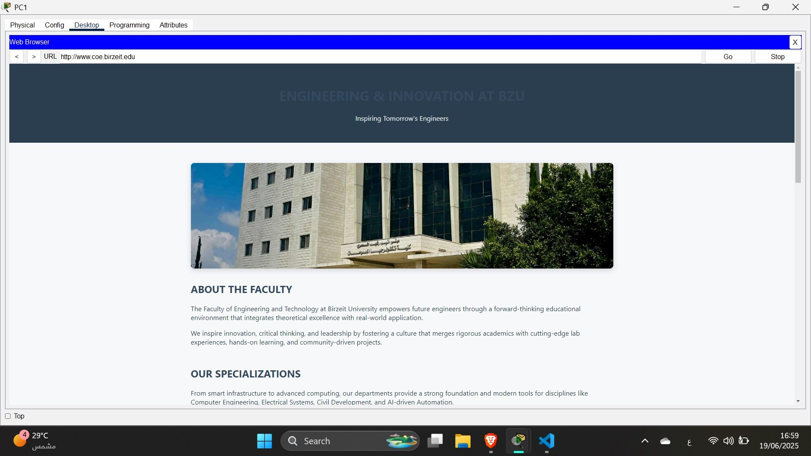
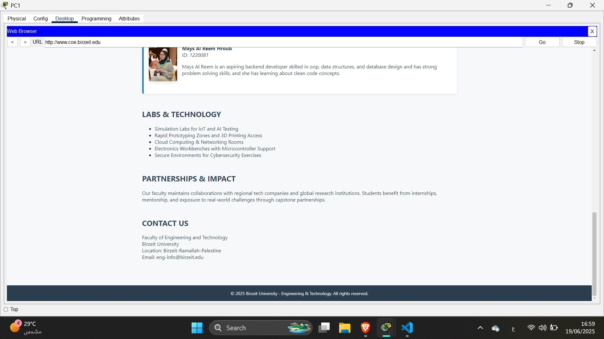

# ENCS3320 Project 2 — *Smart Multi-Zone Network Simulation*⚙️

Welcome to the GitHub repository for our **Computer Networks Project (ENCS3320)** at **Birzeit University – Second Semester 2025/2026**.

This project simulates a real-world, multi-area network including a university campus, street zone, home zone, and a datacenter — all interconnected using **OSPF routing**, with full services including **DHCP**, **DNS**, **Web**, and **Email**, implemented and tested in **Cisco Packet Tracer**.

---

## 📌 Project Summary

- 🔁 **Routing**: OSPF (Area 0 - backbone)
- 📶 **Wireless**: Access Point + Cell Tower Simulation
- 💻 **Services**: DHCP, DNS, Web (Apache), Email (SMTP/POP3)
- 🧠 **IP Planning**: Subnetting using CIDR & VLSM based on student ID `1220701`
- ⚒️ **Tools**: Cisco Packet Tracer, Packet Tracer CLI, built-in services

---

## 🧠 Network Design

### Topology Zones:
- **Area 0 (Core)**: 3 Routers interconnected via /30 links
- **Area 1 (University)**: DHCP, AP, Laptops, Tablets, Smartphones
- **Area 2 (Street)**: Simulated 4G Cell Tower and wireless clients
- **Area 3 (Home)**: 2 PCs with static IPs
- **Area 4 (Datacenter)**: DNS, Web, and Mail servers

📡 Wireless SSID: `ENCS_T030`  
🔐 WPA2 Security: Enabled  
📍 All subnetting derived from base IP: `170.1.8.0/23` (note: adjusted due to ID typo)

---

## ✏️ Features Implemented

- ✔️ OSPF dynamic routing across 5 zones
- ✔️ DHCP server for dynamic IP assignment (NET1-A)
- ✔️ Static IPs for critical servers & routers
- ✔️ Fully functional DNS server (`dns.coe.birzeit.edu`)
- ✔️ Web server accessible at `www.coe.birzeit.edu`
- ✔️ Email system configured for sending/receiving messages via `mail.coe.birzeit.edu`
- ✔️ Access Point secured with WPA2 for wireless testing
- ✔️ Cell Tower simulation for smartphone internet access

---

## 💻 Screenshots

## 🌐Network Topology

## 🌐HTML Webpage

